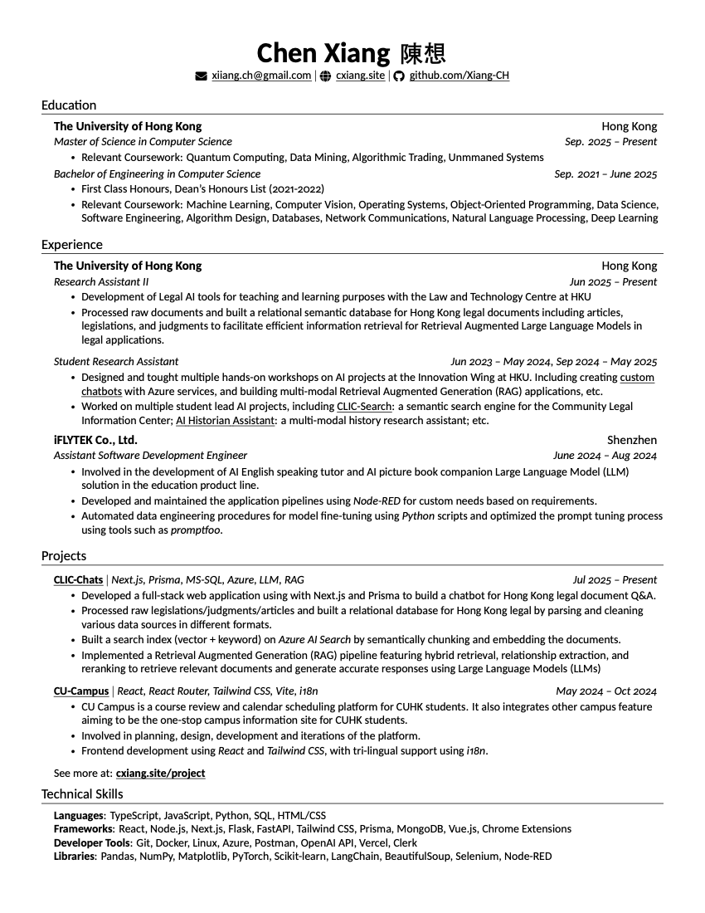

# Chen Xiang's Resume

This is the repository for my resume. It is built using LaTeX based on [Jake Gutierrez's resume template](https://github.com/jakegut/resume). 

It uses XeLaTeX with xeCJK to support Chinese characters. It builds two versions of the resume: one with phone number and one without (for public websites).

## Build
First create a `.env` file in the root directory and add your phone number:
```bash
echo PHONE_NUMBER=\"1234-1234\" > .env
```
Then run the following command to build the resume:
```bash
./build.sh
```

## Preview

